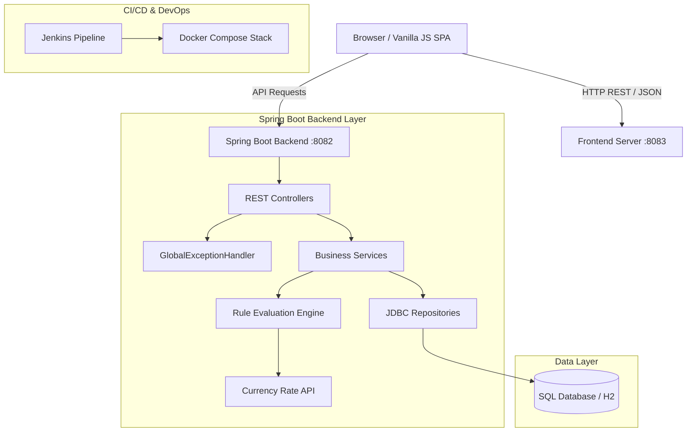

# System Architecture & Technical Stack

This document describes the end-to-end technical architecture, component breakdown, data flows, and technology stack powering **TxnSync**.

---

## 🏗 System Architecture Diagram

---

## 🛠 Technology Stack

| Layer | Component | Technology / Framework |
| :--- | :--- | :--- |
| **Frontend** | UI Rendering | HTML5, Vanilla CSS3 (Custom Design System), Modular ES6 JavaScript |
| **Frontend Charts** | Visualizations | Chart.js |
| **Backend** | Framework | Java 17, Spring Boot 3.x, Spring JDBC |
| **API Protocol** | Communication | RESTful JSON, CORS Configured |
| **Database** | Storage | SQL Database / Embedded H2 (`01-schema.sql`, `02-data.sql`) |
| **Testing** | Unit & Integration | JUnit 5, Mockito, Spring Boot Test |
| **Containerization** | Packaging | Docker Multi-Stage (`Dockerfile`), Docker Compose (`docker-compose.yml`) |
| **CI/CD** | Automation | Jenkins Automation Pipeline (`Jenkinsfile`) |

---

## 📡 REST API Endpoint Matrix

| Method | Endpoint | Description | Service Layer |
| :--- | :--- | :--- | :--- |
| `GET` | `/api/transactions` | Fetch all transactions | `TransactionService` |
| `GET` | `/api/transactions/{id}` | Fetch transaction by ID | `TransactionService` |
| `POST` | `/api/transactions` | Ingest new transaction & run rules | `TransactionService` |
| `GET` | `/api/alerts` | Fetch all fraud alerts | `AlertService` |
| `PUT` | `/api/alerts/{id}/status` | Update alert lifecycle state | `AlertService` |
| `GET` | `/api/rules` | Fetch all fraud rules | `RuleService` |
| `POST` | `/api/rules` | Create new fraud detection rule | `RuleService` |
| `GET` | `/api/accounts` | Fetch account summaries | `AccountService` |
| `GET` | `/health` | Service health check | N/A |
