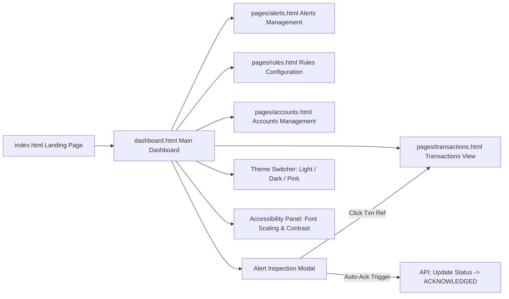

# Frontend Screen Flow & Navigation

This document visualizes the user navigation hierarchy and screen flows across the **TxnSync** web application.

---

## 🗺 Application Navigation Flowchart

---

## 📱 Page & Screen Breakdown

### 1. Main Dashboard (`dashboard.html`)
* **Purpose:** Executive summary and analytics overview.
* **Key Components:**
  * Metric summary cards (Total Transactions, Open Alerts, Rule Trigger Count).
  * Interactive Chart.js widgets: Alert Status Breakdown, Rule Category Trigger Distribution, Volume vs. Alerts Trend.
  * Recent Alerts feed.

### 2. Transactions Screen (`pages/transactions.html`)
* **Purpose:** Full transaction log table and search interface.
* **Key Features:** Filter by currency, status (`PENDING`, `COMPLETED`), search by Payer/Payee account IDs, transaction detail modal.

### 3. Alerts Screen (`pages/alerts.html`)
* **Purpose:** Investigation workbench for fraud analysts.
* **Key Features:** Group alerts by transaction ID, status transition controls (`OPEN` $\rightarrow$ `ACKNOWLEDGED` $\rightarrow$ `INVESTIGATING` $\rightarrow$ `CLOSED`, with `DISMISSED` options), automated trigger reason breakdown.

### 4. Rules Screen (`pages/rules.html`)
* **Purpose:** Fraud rule administration.
* **Key Features:** Active/Inactive toggle switches, currency threshold parameters, volume window settings, rule creation form.

### 5. Accounts Screen (`pages/accounts.html`)
* **Purpose:** Account overview and risk profiles.
* **Key Features:** Account balances, linked institution details, transaction history per account.

### 6. Universal Header & Navigation (`layout.js`, `ui.js`)
* **Tri-Theme Selector:** Instant switching across **Light**, **Dark**, and **Pink** color palettes.
* **Accessibility Control Drawer:** Adjust font size (+ / -), toggle high-contrast mode, manage keyboard focus states.
