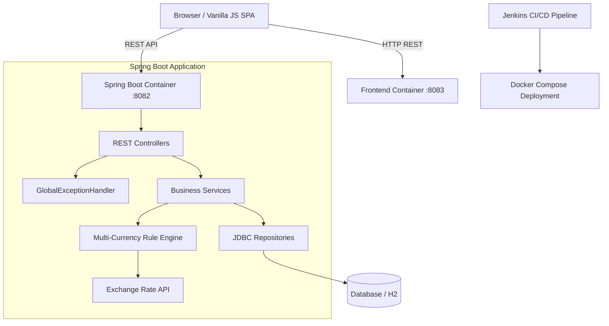

# TxnSync - Documentation Hub & Project Lifecycle Management

Welcome to the **TxnSync** Agile Documentation and Project Tracking Hub. This directory contains complete functional specifications, user stories, architecture diagrams, meeting records, requirement traceability matrices, and architectural decision records.

---

## 📁 Agile Specifications & Core Documentation

| File | Module / Subject | Target Audience |
| :--- | :--- | :--- |
| 📋 [**01-feature-list.md**](./01-feature-list.md) | High-Level Product Features & Epic Breakdown | Product Owners & Stakeholders |
| 📖 [**02-user-stories.md**](./02-user-stories.md) | Agile User Stories (`US-001` to `US-010`) | Development Team & QA |
| 🎯 [**03-acceptance-criteria.md**](./03-acceptance-criteria.md) | Given-When-Then (Gherkin) Acceptance Criteria | Developers & Testers |
| 🏗 [**04-system-architecture.md**](./04-system-architecture.md) | Tech Stack, Component Diagrams & REST Endpoints | Architects & Engineers |
| 🗺 [**05-screen-flow.md**](./05-screen-flow.md) | Frontend UX Navigation & Screen Breakdown | UI/UX & Frontend Engineers |
| 📝 [**MOM.md**](./MOM.md) | Minutes of Customer Meetings (Meeting 1 & 2) | Client & Project Leadership |
| 📊 [**KANBAN.md**](./KANBAN.md) | Task Board & [**GitHub Projects Live Board**](https://github.com/orgs/Neueda-Learning/projects/36/views/2) | Project Team |
| 🔗 [**TRACEABILITY_MATRIX.md**](./TRACEABILITY_MATRIX.md) | Maps Requirements $\rightarrow$ User Stories $\rightarrow$ PRs $\rightarrow$ Commits | Compliance Auditors |
| 📑 [**DECISION_LOG.md**](./DECISION_LOG.md) | Architectural Decision Records (ADRs 01–08) | Tech Leads & Developers |

---

## 🚀 System Architecture Overview

