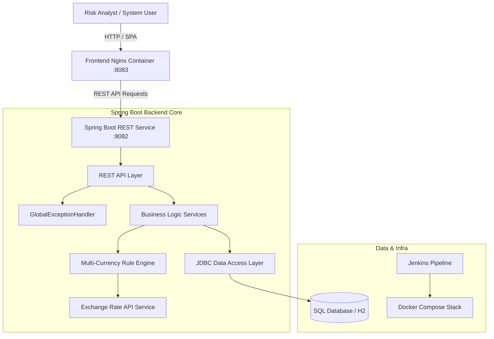

# 🛡️ TxnSync — Real-Time Fraud Transaction & Alert Sync Platform


**TxnSync** is an enterprise-grade financial transaction monitoring, multi-currency rule evaluation, and real-time fraud alert management platform. Built with a high-performance **Spring Boot 3.x** backend and a responsive **Vanilla JS/CSS** dashboard, TxnSync automatically ingests transactions, normalizes foreign currencies, evaluates risk thresholds, and enforces strict alert investigation workflows.

---

## 🏗️ System Architecture



---

## ✨ Key Features & Capabilities

### 💳 1. Fraud Transaction Engine
* Ingests financial transactions across accounts with support for multiple currencies (`USD`, `EUR`, `GBP`, `INR`, etc.).
* Automated risk scoring for transaction movement, anomaly detection, and new/unseen payee identification.

### 💱 2. Dynamic Multi-Currency Rule Evaluation
* Integrates with a real-time **Currency Exchange Rate API** (`CurrencyRateApi`) to normalize foreign currency transaction amounts to base currency before threshold rule evaluation.
* Supports active/inactive toggles for Amount Threshold Rules, Volume-vs-Alerts Velocity Rules, and New Payee Rules.

### 🔔 3. Alert Lifecycle State Machine
* Enforces a strict, audited investigation lifecycle:
  $$\text{OPEN} \longrightarrow \text{ACKNOWLEDGED} \longrightarrow \text{INVESTIGATING} \longrightarrow \text{CLOSED}$$
* **Auto-Acknowledgment on Inspection:** Opening an alert automatically transitions its status from `OPEN` to `ACKNOWLEDGED` to eliminate repetitive manual clicks.

### 🎨 4. Tri-Theme & Accessibility User Experience
* **Tri-Theme Engine:** One-click instant switching between **Light Mode**, **Dark Mode**, and **Pink Mode** with `localStorage` persistence.
* **Accessibility Drawer:** Built-in font scaling (+ / -), high-contrast toggle mode, and ARIA-compliant UI components.
* **Interactive Data Visualizations:** Integrated Chart.js analytics for Alert Lifecycle breakdown, Rule-Type trigger distribution, and Transaction Volume trends.

### 🛡️ 5. Enterprise Hardening & Automated Testing
* **Centralized Exception Handling:** Spring `@ControllerAdvice` (`GlobalExceptionHandler`) catching custom domain exceptions and returning uniform, client-friendly HTTP JSON errors.
* **50+ Automated Unit & MockMVC Integration Tests:** Complete test coverage across controllers (`AccountControllerTest`, `AlertControllerTest`, `RuleControllerTest`, `TransactionControllerTest`) and service layers (`TransactionServiceTest`, `AlertServiceTest`, `RuleServiceTest`, `AccountServiceTest`).

### 🐳 6. Containerization & CI/CD Pipeline
* **Multi-Stage Docker Builds:** Optimized `Dockerfile` definitions for both Spring Boot backend and Nginx/Static frontend.
* **Zero-Configuration Orchestration:** `docker-compose.yml` launches the complete stack (Backend on `:8082`, Frontend on `:8083`, DB readiness checks) with a single command.
* **Jenkins Automation:** Enterprise `Jenkinsfile` for continuous build, test execution, and image artifact packaging.

---

## 🛠️ Technology Stack

| Layer | Component | Technology |
| :--- | :--- | :--- |
| **Backend Framework** | Application Server | Java 17, Spring Boot 3.x, Spring MVC |
| **Data Access** | Persistence | Spring JDBC (`JdbcTemplate`), Hand-written Repository SQL |
| **Database** | Database Engine | SQL Database / Embedded H2 (`01-schema.sql`, `02-data.sql`) |
| **Testing** | QA & Integration | JUnit 5, Mockito, Spring Boot Test |
| **Frontend UI** | Presentation | HTML5, Vanilla CSS3 (Custom Design System), Modular ES6 JS |
| **Visualizations** | Charts | Chart.js |
| **Containerization** | DevOps | Docker, Docker Compose |
| **CI/CD** | Pipeline | Jenkins (`Jenkinsfile`) |

---

## 🚀 Quick Start & Deployment

### Option A: Zero-Config Docker Compose (Recommended)

Run the full production-ready stack (Backend, Frontend, DB) with one command:

```bash
docker-compose up --build
```

Access the services:
* 🌐 **Web Dashboard:** `http://localhost:8083`
* 🔌 **Backend REST API:** `http://localhost:8082`

---

### Option B: Local Development Execution

#### 1. Backend Setup (Spring Boot)
```bash
cd backend/txnSync

# Run via Maven Wrapper (Windows)
.\mvnw.cmd spring-boot:run

# Run via Maven Wrapper (Linux/macOS)
./mvnw spring-boot:run
```
The backend API starts at `http://localhost:8080`.

#### 2. Frontend Setup
The `frontend/` directory consists of static ES6 web assets:
```bash
cd frontend
python -m http.server 5500
```
Open `http://localhost:5500` in your browser.

---

### Option C: Running Automated Tests

To execute the full suite of 50+ unit and integration tests:

```bash
cd backend/txnSync
./mvnw test
```

---

## ⚙️ Environment Configuration

Backend properties in `application.properties` can be overridden via environment variables:

| Property | Environment Variable | Default Value | Description |
| :--- | :--- | :--- | :--- |
| `server.port` | `PORT` | `8080` (Local) / `8082` (Docker) | HTTP Server Port |
| `spring.datasource.url` | `DB_URL` | `jdbc:h2:mem:txn_sync_db` | JDBC Database Connection URL |
| `spring.datasource.username` | `DB_USER` | `sa` | Database User |
| `spring.datasource.password` | `DB_PASS` | — | Database Password |
| `app.cors.origins` | `APP_CORS_ORIGINS` | `*` | Allowed CORS Origins |

---

## 🔌 REST API Quick Reference

| Method | Endpoint | Description | Status Code |
| :--- | :--- | :--- | :--- |
| `GET` | `/api/v1/transactions` | Fetch all financial transactions | `200 OK` |
| `POST` | `/api/v1/transactions` | Ingest transaction & trigger rule engine | `201 Created` |
| `GET` | `/api/v1/alerts` | Fetch all fraud alerts | `200 OK` |
| `PUT` | `/api/v1/alerts/{id}/status` | Update alert lifecycle state (`OPEN` $\rightarrow$ `CLOSED`) | `200 OK` |
| `GET` | `/api/v1/rules` | List all active/inactive fraud rules | `200 OK` |
| `POST` | `/api/v1/rules` | Create new fraud threshold rule | `201 Created` |
| `GET` | `/health` | Application health check endpoint | `200 OK` |

---

## 📂 Repository Structure

```
.
├── backend/txnSync/              # Spring Boot 3.x Backend (Java 17)
│   ├── Dockerfile                # Multi-stage Docker build for Backend
│   ├── src/main/java/            # Controllers, Services, Repositories, Models
│   └── src/test/java/            # Comprehensive 50+ Unit & Integration Tests
├── database/                     # SQL Database Scripts
│   ├── 01-schema.sql             # Table DDL definitions
│   └── 02-data.sql               # Seed data
├── frontend/                     # Vanilla JS Dashboard (Static SPA)
│   ├── Dockerfile                # Nginx Docker container for Frontend
│   ├── dashboard.html            # Main Dashboard SPA view
│   ├── css/                      # Modular CSS stylesheets
│   └── js/                       # Modular ES6 controllers & API layer
├── chirag/                       # Agile Product & Project Documentation Suite
│   ├── README.md                 # Agile Documentation Hub Index
│   ├── 01-feature-list.md        # Epic Breakdown & Feature Specs
│   ├── 02-user-stories.md        # Agile User Stories
│   ├── 03-acceptance-criteria.md # Given-When-Then Acceptance Criteria
│   ├── 04-system-architecture.md# Technical Architecture & Diagram
│   ├── 05-screen-flow.md         # UI Navigation Flow
│   ├── KANBAN.md                 # Project Task Board
│   ├── MOM.md                    # Minutes of Customer Meetings
│   ├── TRACEABILITY_MATRIX.md    # Requirement Traceability Matrix
│   └── DECISION_LOG.md           # Architectural Decision Records (ADRs)
├── docker-compose.yml            # Full stack multi-container orchestration
└── Jenkinsfile                   # CI/CD Automation Pipeline
```

---

## 📋 Agile Project Documentation Hub

For complete product specifications, user stories, Gherkin acceptance criteria, customer meeting notes, and requirement traceability matrices, visit our **Agile Project Hub**:

* 📖 [**Agile Documentation Suite (`/chirag/README.md`)**](./chirag/README.md)
* 📊 [**Live GitHub Projects Board**](https://github.com/orgs/Neueda-Learning/projects/36/views/2)

---

## 📜 License

Distributed under the MIT License. See `LICENSE` for more information.
